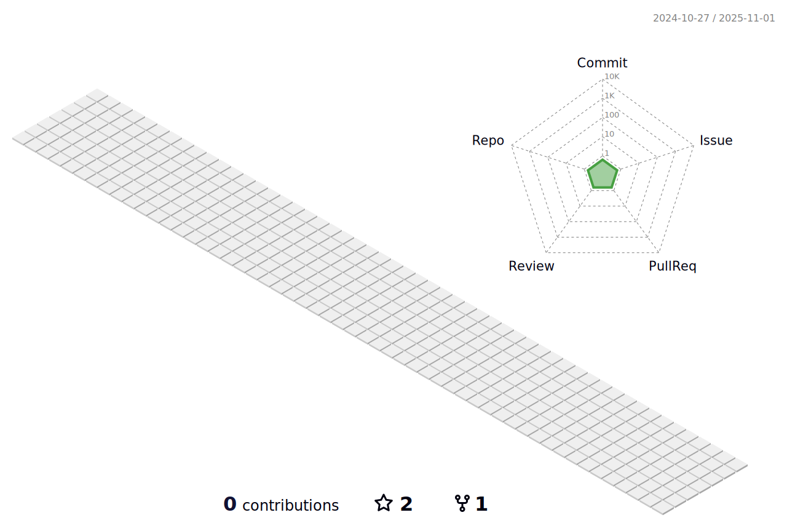

<!-- ### Hi there 👋

**saramnim/saramnim** is a ✨ _special_ ✨ repository because its `README.md` (this file) appears on your GitHub profile.

Here are some ideas to get you started:

- 🔭 I’m currently working on ...
- 🌱 I’m currently learning ...
- 👯 I’m looking to collaborate on ...
- 🤔 I’m looking for help with ...
- 💬 Ask me about ...
- 📫 How to reach me: ...
- 😄 Pronouns: ...
- ⚡ Fun fact: ...
-->

 

 
  
 
## ✨ introduction ✨

열심히 배워가는 꼬마 개발자입니다 

### 🌞 Tech Stacks 🌞

 
 
  

 

 

 

 

### 🌙 Cowork tools 🌙

 

 
### 🎁 skill 🎁
<!---->

 
### 🌱 studying 🌱

고려대학교 세종캠퍼스 2017.03 ~ 2022.02 
엘리스 sw 부트캠프 3기 2022.09 ~ 2022.12 
<!--
### 💪 Problem Solving 💪
 
-->
### 🔥 Github Status

 

---

### 🌌 other site 🌌

 https://www.notion.so/4bfe551bc9db4568905c0b92e132b0ff 

 https://velog.io/@saramnim
 
 
 

